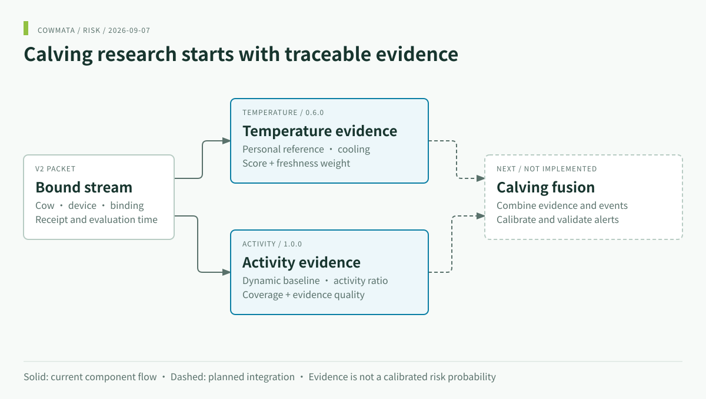
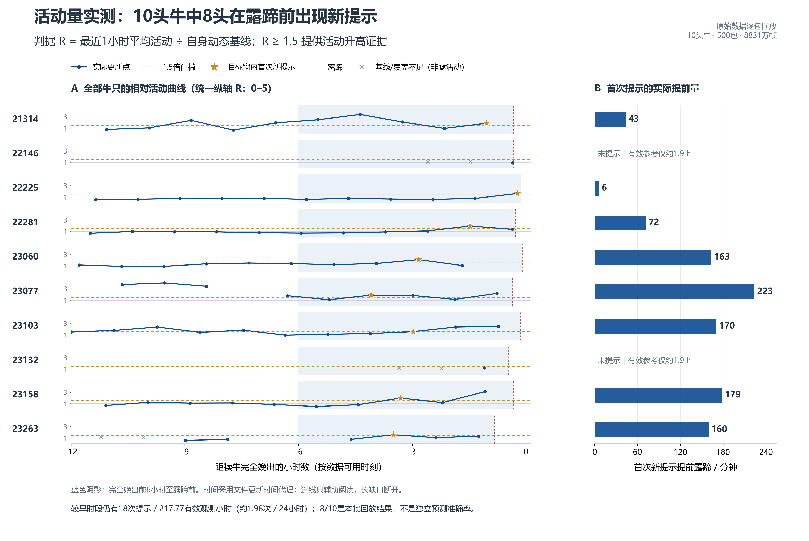

<div align="center">


# COWMATA · Risk Decision Research

**Traceable temperature and activity evidence for calving experiments.**

[](https://github.com/zxq309/cowmata-risk/actions/workflows/tests.yml)


[English](README.md) · [简体中文](README.zh-CN.md) · [Project overview](https://github.com/zxq309/cowmata)

</div>



## What is available

Run temperature and activity evidence modules for calving experiments. Both modules execute independently and return quality and freshness metadata. Calibrated fusion, ETA and a unified alert policy are not implemented.

| Module | Input | Output | Entry |
|---|---|---|---|
| Temperature 0.6.0 | Bound packet, temperature and timing | Evidence score, grade, freshness weight | [Guide](docs/MODULES.en.md#temperature) |
| Activity 1.0.0 | Bound V2 IMU packet | Activity ratio, baseline, coverage and evidence | [Guide](docs/MODULES.en.md#activity) |
| Calving fusion | Future evidence + event adapter | Not implemented | [Integration](docs/INTEGRATION.en.md) |

## Quick start

```sh
git clone https://github.com/zxq309/cowmata-risk.git
cd cowmata-risk
python -m venv .venv
# Windows: .\.venv\Scripts\Activate.ps1
# Linux/macOS: source .venv/bin/activate
python -m pip install -r requirements-dev.txt
python examples/calving_evidence_demo.py
```

Authorized GitHub access is required to clone. Module minimum: Python 3.8; CI targets Python 3.10 and 3.12. Run all install commands from the repository root.

## Understand the demo

```json
{
  "synthetic": true,
  "fusion_implemented": false,
  "temperature_quality": "ESTIMATE_UPDATED",
  "activity_quality": "LOW_COVERAGE"
}
```

This excerpt comes from the synthetic V2 packet demo. The full output includes each module's fusion features. A short packet is insufficient to establish an activity baseline, so evidence remains unavailable. There is no predicted calving probability or fabricated alarm. See [the English module guide](docs/MODULES.en.md) for Python usage and timing semantics.

## Experimental evidence



**Historical exploratory figure**, imported with the activity module. The source report covers 10 cows and 500 packets and explicitly describes reproducibility on development data, not independent predictive accuracy. [Original report (Chinese)](modules/activity/说明/实测报告.md). The temperature validation directory referenced by the original delivery was not supplied; this repository does not claim to have rerun it.

## Verify and integrate

```sh
python -m unittest discover -s modules/activity/验证/tests -v
python -m unittest discover -s tests -v
```

Keep one state per cow/device binding, process sequentially, and distinguish collection, server receipt and evaluation times. Missing evidence is not negative evidence. Module schemas remain authoritative; see [integration](docs/INTEGRATION.en.md), [software verification](docs/VERIFICATION.md), [data access](data/README.md) and [import provenance](docs/MIGRATION.md).

## Repository map

```text
modules/temperature/   temperature package, parameters, schema, original guide
modules/activity/      activity package, schema, tests, historical experiments
examples/              synthetic packet demo
tests/                 installed-package integration checks
docs/                  integration, evidence boundaries and provenance
assets/                brand and bilingual architecture
data/                  local-data instructions; actual data stays outside Git
```


[Contributing](CONTRIBUTING.md) · [Security](SECURITY.md) · [Notice](NOTICE)

## Latest update

**2026-09-07** — Focused this page on functionality, usage and validation; software and model versions are unchanged. [Full changelog](CHANGELOG.md).
