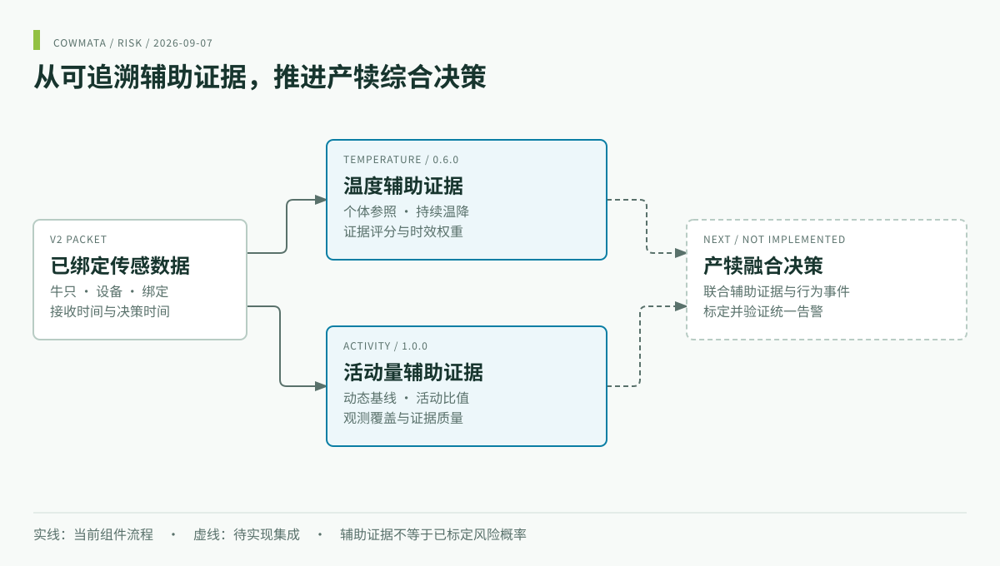

<div align="center">
<a href="https://www.cowmata.com/"></a>

# COWMATA · 综合预警决策研究

**面向产犊实验的可追溯温度与活动量证据。**

[](https://github.com/zxq309/cowmata-risk/actions/workflows/tests.yml)


[English](README.md) · [简体中文](README.zh-CN.md) · [COWMATA](https://github.com/zxq309/cowmata)

</div>



## 最新更新

**2026-09-07** — 完善双语说明、品牌框图、模块入口、可运行证据演示和验证边界。[完整更新记录](CHANGELOG.md)。模块版本保持温度 **0.6.0**、活动量 **1.0.0**。

## 已有能力

本私有仓负责辅助证据与下游综合决策研究，当前主线为产犊。两个已导入模块可以独立运行；已标定融合概率、预计产犊时间和统一告警策略尚未实现。

| 模块 | 输入 | 输出 | 入口 |
|---|---|---|---|
| 温度 0.6.0 | 已绑定数据包、温度及时间信息 | 证据评分、等级、时效权重 | [技术说明](modules/temperature/说明/技术说明.md) |
| 活动量 1.0.0 | 已绑定 V2 IMU 数据包 | 活动比值、基线、覆盖与证据 | [技术说明](modules/activity/说明/技术说明.md) |
| 产犊融合 | 待接入的多模态证据与行为事件 | 尚未实现 | [集成约定](docs/INTEGRATION.md) |
| 发情／妊娠／健康 | 后续各任务数据 | 规划中 | [路线图](docs/ROADMAP.md) |

## 快速开始

```sh
git clone https://github.com/zxq309/cowmata-risk.git
cd cowmata-risk
python -m venv .venv
# Windows: .\.venv\Scripts\Activate.ps1
# Linux/macOS: source .venv/bin/activate
python -m pip install -r requirements-dev.txt
python examples/calving_evidence_demo.py
```

克隆需要 GitHub 仓库访问权限。模块最低支持 Python 3.8；CI 使用 Python 3.10 和 3.12。安装命令在仓库根目录执行。

## 如何理解演示

```json
{
  "synthetic": true,
  "fusion_implemented": false,
  "temperature_quality": "ESTIMATE_UPDATED",
  "activity_quality": "LOW_COVERAGE"
}
```

以上为合成 V2 包演示的部分真实输出，完整输出还包括两个模块各自的融合特征。短包不足以建立活动基线，因此活动证据不可用；不产生未经标定的产犊概率或人为拼接的告警。

## 实验依据


**历史探索实验图**，随活动量模块导入。原报告覆盖 10 头牛、500 包，并明确属于开发数据上的可复现性验收，不是独立预测准确率。[原实测报告](modules/activity/说明/实测报告.md)。原温度交付引用的旧验证目录未提供，本仓不声称已经复验。

## 验证与接入

```sh
python -m unittest discover -s modules/activity/验证/tests -v
python -m unittest discover -s tests -v
```

每个牛—设备绑定独立保存状态，串行处理，区分采集、服务器接收和决策时间；证据缺失不能视为低风险。各模块 Schema 为当前输出依据。见[集成约定](docs/INTEGRATION.md)、[软件验证](docs/VERIFICATION.md)、[数据说明](data/README.md)和[导入溯源](docs/MIGRATION.md)。

## 仓库导航

```text
modules/temperature/   temperature package, parameters, schema, original guide
modules/activity/      activity package, schema, tests, historical experiments
examples/              synthetic packet demo
tests/                 installed-package integration checks
docs/                  integration, evidence boundaries and provenance
assets/                brand and bilingual architecture
data/                  local-data instructions; actual data stays outside Git
```

## 关联仓库

| 仓库 | 主要职责 |
|---|---|
| [cowmata](https://github.com/zxq309/cowmata) | 总体架构、路线图与演示 |
| [cowmata-tailring](https://github.com/zxq309/cowmata-tailring) | 行为事件训练、推理与评估 |
| [cowmata-risk](https://github.com/zxq309/cowmata-risk) | 综合决策研究；私有，需授权访问 |
| [cattle-tail-ring-annotator](https://github.com/zxq309/cattle-tail-ring-annotator) | 人工标注与候选复核 |

[Contributing](CONTRIBUTING.md) · [Security](SECURITY.md) · [Notice](NOTICE)
